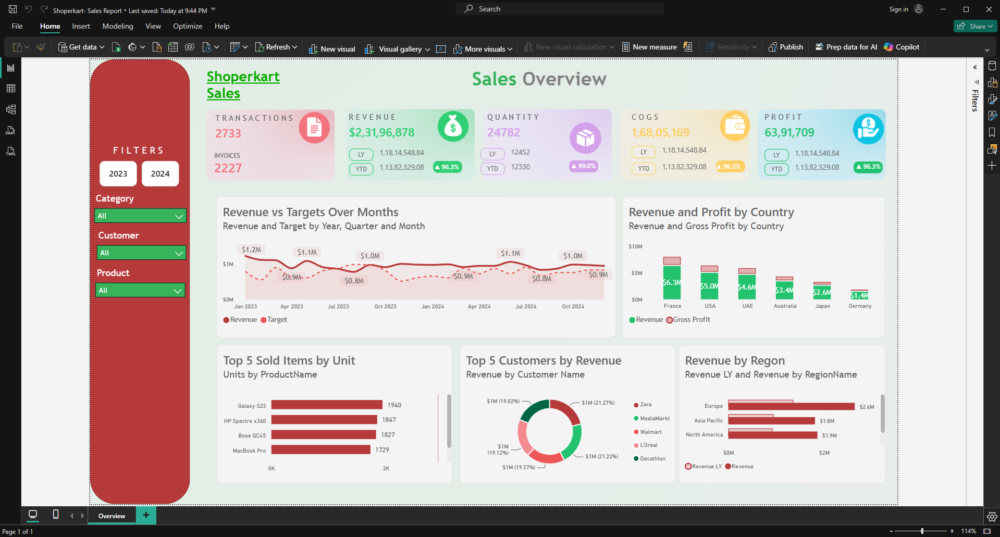

# Shoperkart Retail Sales Report - Dashboard Portfolio

A corporate retail performance dashboard tracking store sales metrics, profitability margins, product popularity, and customer segments dynamically against monthly regional target quotas.

> [!NOTE]
> **Disclaimer:** None of the data used in this report is sourced from private or active customers. All files, tables, and records correspond to dummy datasets that are generally and publicly available on the internet for training and development purposes.

---

## 📸 Dashboard Preview

---

## 💼 Business Impact & Insights

The **Shoperkart Sales & Target Report** aligns day-to-day store transactions with high-level corporate sales goals:

* **Dynamic Quota & Target Achievement:** By tracking the **Revenue Variance vs. Target** (MTD, QTD, YTD), regional sales directors can instantly identify which territories or products are lagging behind their targets. This allows them to adjust marketing, pricing, or incentive schemes before the quarter ends.
* **Profitability & Pricing Protection:** Tracking **Gross Profit** and **Gross Margin %** alongside **Discount %** ensures that sales volume isn't generated at the expense of profitability. It flags stores that are over-discounting to inflate sales volume, preserving healthy margins.
* **Product Portfolio Management:** Calculating product rankings dynamically based on YTD revenue allows inventory managers to allocate warehouse space and supply orders to the top 20% of high-volume SKUs, reducing slow-moving capital blockages.
* **Customer Loyalty Optimization:** Highlighting top customers through dense rankings enables marketing teams to run targeted loyalty campaigns and personalized promotions to secure high-value recurring revenue.

---

## 🔮 Future Scope & Enhancements

To expand this retail target analytics model, the following enhancements are planned:

* **What-If Pricing Scenarios:** Implement what-if parameters in Power BI to allow sales directors to model the impact of changing product prices or reducing regional discount limits on gross margin and target quota compliance.
* **Dynamic Row-Level Security (RLS):** Set up roles where individual store managers are restricted to viewing only their local sales and targets, while regional heads see aggregated state metrics, and corporate leadership retains full global access.
* **Power Automate Quota Alerts:** Configure automated emails or Teams notifications to ping regional directors when a store's actual revenue drops 10% below target MTD or QTD.
* **Supplier Lead-Time Correlation:** Integrate supplier delivery lead times into the model to predict target quota gaps caused by inventory stockouts.

---

## 📊 Overview & Data Model

The **Shoperkart Sales & Target Report** addresses the complexity of comparing actual daily transactions against monthly target quotas defined at a higher grain.

### Data Source & Schema
* **Source Dataset:** Local Excel Workbook: [PowerBI_AI_Demo_Dataset.xlsx](PowerBI_AI_Demo_Dataset.xlsx) (Contains worksheets for Customers, Products, Regions, Sales, and Targets).
* **Schema Design:** Optimized **Galaxy (Multi-Fact) Schema**
  * **Fact Tables:**
    * `FactSales` (Daily transactional sale entries recording ProductKey, CustomerKey, RegionKey, Quantity, and Revenue).
    * `FactTargets` (Monthly target amount quotas assigned per RegionKey and ProductKey).
  * **Dimension Tables:** `DimCustomer`, `DimProduct`, `DimRegion`, `DimDate`. These dimensions are shared between both fact tables, allowing users to slice actuals and targets side-by-side.
* **Granularity:** Daily transactional grain for actual sales vs. monthly/regional grain for quotas.

---

## 📑 Dashboard Pages & Visuals

The report features a comprehensive **Retail Analytics** dashboard page:
* **Objective:** Audit quota attainment percentages, identify high-value customer/product brackets, and monitor discounting margin leakage.
* **Core Metrics Managed:** Revenue, Target Quota, Revenue Variance vs. Target (and variance %), Gross Profit, Gross Margin %, Cost of Goods Sold (COGS), Average Selling Price (ASP), Discount %, and customer/product ranking lists.
* **Key Visuals:** Matrix comparisons relating sales to targets, custom gauges indicating target achievement, and sorted bar charts outlining top-performing items.

---

## ⚡ ETL Transformations & Power Query

Ingestion and shaping of Shoperkart tables are handled in Power Query:
1. **Source Loading:** Reads sheets from the workbook using `Excel.Workbook()`.
2. **Promoting Headers:** Promoting table headers.
3. **Key Normalization:** Re-mapping customer and product codes, and converting regional indices to ensure clean relationship lookups.
4. **Data Type Coercion:** Converting financial fields (e.g. `Revenue` and `TargetAmount` to decimals, `Quantity` to integers) to prevent model discrepancies.
